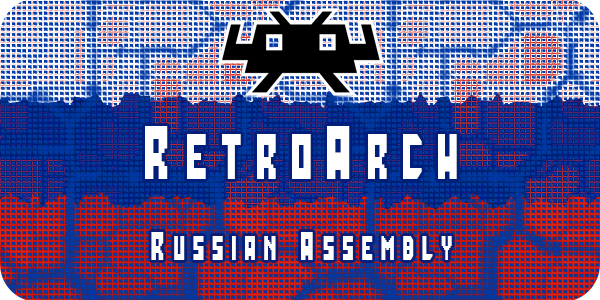

=======

# RARA (RetroArch Russian Assembly) 

Сборка русифицированных ретроигр для универсальной оболочки RetroArch.

**RetroArch** - это универсальная оболочка для десятков различных эмуляторов ретроконсолей. В противовес отдельным эмуляторам для каждой платформы с разными настройками и интерфейсом RetroArch предлагает единую библиотеку игр с удобной навигацией и сортировкой. Это означает, что больше не нужно переключаться между приложениями и думать, какое из них подходит для той или иной платформы, - достаточно выбрать игру, и она сразу же запустится. При этом RetroArch поддерживает практически любые геймпады, отображает обложки и скриншоты игр, улучшает картинку и умеет ещё уйму других полезных вещей. Это отличный лаунчер эмуляторов для тех, кто не хочет ограничиваться одной консолью, а хочет получить в своё распоряжение сразу много игровых приставок со всеми доступными играми.

##  Состав сборки

Сборка состоит только из плейлистов, набора ромов и превью изображений к играм и не включает в себя саму программу **RetroArch**.

Включены игры для следующих платформ:

- **Nintendo Entertainment System** (NES) в Северной Америке и Европе, Famicom (от FAMIly COMputer — семейный компьютер) в Японии, Hyundai Comboy в Южной Корее, клон в России — Денди: восьмибитная игровая консоль, популярная во второй половине 1980-х и начале 1990-х годов.
> Русифицированных игр: 836
 

- **Super Nintendo Entertainment System** (также известная как Super Nintendo, Super NES и SNES) — 16-разрядная игровая приставка, выпущенная компанией Nintendo в США, Бразилии, Европе и Австралии. В Японии она известна под названием Super Famicom, сокращение от Super Family Computer, или SFC. В Южной Корее она называлась Super Comboy (кор. Сюпхо кхомбои) и распространялась Hyundai Electronics.
> Русифицированных игр: 54
 

- **Sega Mega Drive 2** (яп. Мэга Дорайбу), в Северной Америке известна как Sega Genesis — игровая приставка четвёртого поколения, разработанная и выпускавшаяся компанией Sega. Приставка была выпущена в 1988 в Японии как Mega Drive, в 1989 в США как Genesis и в 1990 в Европе (Virgin Mastertronic), Австралии (Ozisoft) и Бразилии (Tec Toy) — вновь под названием Mega Drive.
> Русифицированных игр: 312
 

- **Sega Master System** и **SG1000** (яп. Масута: Сисутэму, SMS) — 8-битная игровая приставка третьего поколения, разработанная и выпущенная компанией Sega. Изначально приставка была выпущена в Японии в 1985 году под названием Sega Mark III. После модернизации перед изданием в Северной Америке, приставка была переименована в Master System и выпущена в 1986 году в США, в 1987 году в Европе, и в 1989 году в Бразилии.
> Русифицированных игр: 8
 

- **Sega 32x** — дополнение для игровой приставки Sega Mega Drive. 32X, получившая кодовое название Project Mars, была разработана для расширения возможностей Mega Drive и служила переходной приставкой к 32-битной эре вплоть до выхода Sega Saturn. Независимо от Mega Drive, 32X использует собственные игровые картриджи и имеет собственную библиотеку игр. Она распространялась под названиями *Super 32X* в Японии, *Genesis 32X* в Северной Америке, *Mega 32X* в Бразилии, и *Mega Drive 32X* во всех остальных регионах.
> Игр на английском: 39
 

- **Game B0oy** и **Color** (яп. Гэ:му Бо:й) — линейка портативных игровых устройств, разработанная и производившаяся Nintendo.
> Русифицированных игр: 101
 

- **Game Boy Advance** (яп. Гэ:му Бо:й Адобансу, сокращённо GBA) — 32-разрядная портативная игровая система компании Nintendo. Является наследницей Game Boy Color.
> Русифицированных игр: 393
 

- **DOS** (англ. Disk Operating System — «дисковая операционная система», *ДОС*) — семейство операционных систем для PC-совместимых компьютеров, происходящих от MS DOS и PC DOS и совместимых с ними. До появления Windows 95 системы класса DOS были наиболее популярными операционными системами для PC, несмотря на их ограничения. 
> Русифицированных игр: 33
 

- **ScummVM** — собрание созданных заново (независимо от разработчиков оригиналов) игровых движков, изначально разработанное для запуска игр фирмы LucasArts, использующие систему SCUMM (VM в названии обозначает виртуальная машина, англ. virtual machine). Благодаря продуманной архитектуре ScummVM также поддерживает множество не-SCUMM-игр таких компаний, как Revolution Software и Adventure Soft, для которых разработаны собственные интерфейсы взаимодействия с ресурсами.
> Русифицированных игр: 37
 

## Подготовительные действия

Перед установкой скачайте заранее на свой компьютер [торрент](https://rutracker.org/forum/viewtopic.php?t=6487443) и клонируйте данный Git-репозиторий.  

## Порядок установки для Nintendo Switch

1. Скачать последнюю версию [RetroArch для Nintendo Switch](https://www.retroarch.com/?page=platforms) с официального сайта.
2. Переместить папки `retroarch`, `switch` и файл `retroarch.jpg` в корень вашей карты памяти.
3. Найти и установить актуальный [NSP-форвардер](https://www.google.com/search?q=Nintendo+Switch+Retroarch+%D1%84%D0%BE%D1%80%D0%B2%D0%B0%D1%80%D0%B4%D0%B5%D1%80&oq=Nintendo+Switch+Retroarch+%D1%84%D0%BE%D1%80%D0%B2%D0%B0%D1%80%D0%B4%D0%B5%D1%80) для RetroArch.
4. Запустить RetroArch на Nintendo Switch. Включить русский язык интерфейса, если он не выбрался автоматически: **Settings** -> **User** -> **Language** -> **Russian**.
5. Скачать [торрент](https://rutracker.org/forum/viewtopic.php?t=6487443). Скопировать папку `roms` в корень папки `retroarch` на карте памяти вашего устройства.
6. Клонировать данный репозиторий. Скопировать папки `playlists`, `roms` и `thumbnails` в корень папки `retroarch` на карте памяти вашего устройства с заменой.
7. Запустить заново RetroArch на Nintendo Switch. Настроить "Портативные плейлисты": **Настройки** -> **Плейлисты** -> **Портативные плейлисты**. 
8. Настроить каталог для хранения ромов: **Настройки** -> **Каталоги** -> **Браузер файлов** -> Указать путь до директории `roms` (скорее всего, это будет `/retroarch/roms`).
9. Настроить показ дополнительных эскизов в плейлистах: **Настройки** -> **Интерфейс** -> **Оформление** -> **Дополнительный эскиз** -> **Скриншот**.
10. Если вы хотите играть в DOS игры, то вам необходимо произвести начальную настройку ядра **DOSBox-Pure** согласно [инструкции](https://docs.libretro.com/library/dosbox_pure/).
11. Если вы хотите играть в квесты на движке ScummVM, то вам необходимо произвести начальную настройку ядра **ScummVM** согласно [инструкции](https://docs.libretro.com/library/scummvm/).
12. На этом все! Можно играть или можно поизучать дополнительные материалы.

## Порядок установки для Steam Deck

Порядок установки в целом совпадает с инструкцией для Nintendo Switch за тем исключением, что сам RetroArch можно установить из Steam.

Базовая директория, в которую устанавливается RetroArch: `/home/deck/.local/share/Steam/steamapps/common/RetroArch`.

##  Порядок установки для Android

1. Зайти с телефона на официальный сайт [RetroArch](https://www.retroarch.com/) и скачать последнюю версию APK файла.
2. Установить скаченный APK файл.
3. Запустить RetroArch. Включить русский язык интерфейса, если он не выбрался автоматически: **Settings** -> **User** -> **Language** -> **Russian**.
4. В самом RetroArch скачать следующие ядра (**Главное меню** -> **Онлайн обновления** -> **Скачать ядра**):
    - Nintendo - NES / Famicom (FCEUmm)
    - Nintendo - SNES / SFC (Snes9x)
    - Sega - MS/GG/MD/CD (Genesis Plus GX)
    - Sega - MS/GG/MD/CD/32X (PicoDrive)
    - Nintendo - Game Boy / Color (Gambatte)
    - Nintendo - Game Boy Advance (mGBA)
    - DOS (DOSBox-Pure)
    - ScummVM
5. Подключить телефон к компьютеру по USB в режиме обмена файлами и открыть папку "retroarch". Возможно, она будет расположена на карте памяти.
6. Скачать [торрент](https://rutracker.org/forum/viewtopic.php?t=6487443). Скопировать папку `roms` в корень папки `retroarch` на телефоне.
7. Клонировать данный репозиторий. Скопировать папки `playlists`, `roms` и `thumbnails` в корень папки `retroarch` на телефоне с заменой.
8. Запустить заново RetroArch на телефоне. Настроить "Портативные плейлисты": **Настройки** -> **Плейлисты** -> **Портативные плейлисты**.
9. Настроить каталог для хранения ромов: **Настройки** -> **Каталоги** -> **Браузер файлов** -> Указать путь до директории `roms`.
10. Настроить показ дополнительных эскизов в плейлистах: **Настройки** -> **Интерфейс** -> **Оформление** -> **Дополнительный эскиз** -> **Скриншот**.
11. Если вы хотите играть в DOS игры, то вам необходимо произвести начальную настройку ядра **DOSBox-Pure** согласно [инструкции](https://docs.libretro.com/library/dosbox_pure/).
12. Если вы хотите играть в квесты на движке ScummVM, то вам необходимо произвести начальную настройку ядра **ScummVM** согласно [инструкции](https://docs.libretro.com/library/scummvm/).
13. На этом все! Можно играть или можно поизучать дополнительные материалы.

##  Порядок установки для Windows

1. Скачать последнюю версию [RetroArch для Windows](https://www.retroarch.com/?page=platforms) с официального сайта.
2. Установить.
3. Запустить RetroArch. Включить русский язык интерфейса, если он не выбрался автоматически: **Settings** -> **User** -> **Language** -> **Russian**.
4. В самом RetroArch скачать следующие ядра (**Главное меню** -> **Онлайн обновления** -> **Скачать ядра**):
    - Nintendo - NES / Famicom (FCEUmm)
    - Nintendo - SNES / SFC (Snes9x)
    - Sega - MS/GG/MD/CD (Genesis Plus GX)
    - Sega - MS/GG/MD/CD/32X (PicoDrive)
    - Nintendo - Game Boy / Color (Gambatte)
    - Nintendo - Game Boy Advance (mGBA)
    - DOS (DOSBox-Pure)
    - ScummVM
5. Скачать [торрент](https://rutracker.org/forum/viewtopic.php?t=6487443). Скопировать папку `roms` в корень установленной программы RetroArch.
7. Клонировать данный репозиторий. Скопировать папки `playlists`, `roms` и `thumbnails` в корень установленной программы RetroArch с заменой.
8. Запустить заново RetroArch. Настроить "Портативные плейлисты": **Настройки** -> **Плейлисты** -> **Портативные плейлисты**.
9. Настроить каталог для хранения ромов: **Настройки** -> **Каталоги** -> **Браузер файлов** -> Указать путь до директории `roms`.
10. Настроить показ дополнительных эскизов в плейлистах: **Настройки** -> **Интерфейс** -> **Оформление** -> **Дополнительный эскиз** -> **Скриншот**.
11. Если вы хотите играть в DOS игры, то вам необходимо произвести начальную настройку ядра **DOSBox-Pure** согласно [инструкции](https://docs.libretro.com/library/dosbox_pure/).
12. Если вы хотите играть в квесты на движке ScummVM, то вам необходимо произвести начальную настройку ядра **ScummVM** согласно [инструкции](https://docs.libretro.com/library/scummvm/).
13. На этом все! Можно играть или можно поизучать дополнительные материалы.

## Особенности сборки

Сборка разделена на торрент часть и Git-репозиторий, чтобы иметь возможность оперативно обновлять ее актуальную конфигурацию и вносить различные исправления (в основном в плейлисты).

Сборка требует включения "Портативных плейлистов", чтобы последние были переносимы между разными устройствами. Эта опция, совместно с настройкой "Браузер файлов" позволяет корректировать абсолютные пути 
до директории `roms` на вашем устройстве внутри плейлистов. Вы можете отказаться от данной опции и самостоятельно поменять пути в плейлистах к ромам через массовую замену в текстовом редакторе.

Сборка работает только на версиях RetroArch **1.17.0** и выше!

На данный момент в RetroArch нет возможности удобно выводить описания к играм в плейлист из внутренней базы данных, поэтому описания встроены прямо в боксарты.

Игры для **Sega 32x** не переведены, но включены для расширения кругозора.

В директорию `roms/<scan_content_dir>` можно добавлять свои ромы и обновлять стандартные плейлисты: **Настройки** -> **Плейлисты** -> **Управление плейлистами** -> **<Конкретная консоль>** -> **Обновить плейлист**.

Если в боксарте не получается прочитать описание игры, то его можно увеличить: кнопки ***Select***, ***+*** или ***Space*** (в зависимости от устройства). 

  
Принятые обозначения для переводов:

  
  Так как большинство ромов взяты из раздач [AlexanderBal](https://rutracker.org/forum/tracker.php?rid=21818313), то используются такие же обозначения для переводов.

- "**T+Rus**" или "**T+Eng**" - полный законченный перевод, качество которого не подлежит сомнению.
- "**T-Rus**" или "**T-Eng**" - незаконченный или неполный перевод. Сюда часто относятся полные работы с большим количеством ошибок по части синтаксиса, пунктуации или если присутствуют явные речевые ошибки.
- "**T--Rus**" или "**T--Eng**" - очень сырой перевод (или находящийся на самой начальной стадии), в который не рекомендуется играть. Даже beta версия полного перевода, как правило, всегда на 10 порядков лучше такого вот творчества.

**В скобках указаны ромы стран которые были переведены:**
- (A) Австралия
- (As) Азия
- (B) Бразилия
- (C) Канада
- (Ch) Китай
- (D) Голландия
- (E) Европа
- (F) Франция
- (G) Германия
- (Gr) Греция
- (HK) Гонконг
- (I) Италия
- (J) Япония
- (K) Корея
- (Nl) Голландия
- (No) Норвегия
- (R) Россия
- (S) Испания
- (Sw)Швеция
- (U) США
- (UK) Великобритания
- (W) Всемирный
- (Unl) Не лицензированный
- (PD) Общественное Достояние
- (Unk)Неизвестная страна

## Авторы, переводчики и используемые материалы

Сборка создана с использованием следующих открытых источников.

1. Сайт [emu-land.net](https://www.emu-land.net/). Были взяты описания игр для консолей и сопроводительная информация.
2. Сайт [old-games.ru](https://www.old-games.ru/). Были взяты описания игр для **DOS**, **ScummVM** и сопроводительная информация.
3. Превью к играм взяты из следующих источников в порядке приоритета:
   - Раздача [RetroArch (2022) [Ru] (1.15) Repack Scorpius Inc.](https://rutracker.org/forum/viewtopic.php?t=6383825)
   - Официальный репозиторий [libretro-thumbnails](https://github.com/libretro-thumbnails/libretro-thumbnails)
4. Ромы русифицированных игр для консолей были взяты из раздач [AlexanderBal](https://rutracker.org/forum/tracker.php?rid=21818313).
5. Русифицированные игры для **DOS** и **ScummVM** были взяты из раздачи [Бюро переводов Old-Games](https://rutracker.org/forum/viewtopic.php?t=5588535).

Полные описания ко всем играм можно прочитать на сайтах [emu-land.net](https://www.emu-land.net/) и [old-games.ru](https://www.old-games.ru/). Там же можно сортировать игры по рейтингу и фильтровать по жанрам.

##  Какие устройства лучше всего приобрести для данной сборки
### Сборка на основе Nintendo Switch
1. Заходите на Avito и вбиваете в поиск "Nintendo Switch прошитая". Покупаете у продавца. Есть люди, которые занимаются продажей абсолютно новых прошитых устройств.
2. Докупаете улучшенные джойконы. Например: "OEM MOBAPAD M6".
3. Докупаете дополнительные аксессуары: стекло, чехол или сумку на свой вкус.

### Сборка на основе Android
1. Покупаете самый дешевый смартфон, но на последнем Snapdragon (на момент написания это **Snapdragon 8 Gen2**). Например: "Hot 40 Pro". Лучше купить в цвет геймпада. 
  Примечание. Не приобретайте планшет, особенно с большой диагональю. Так как для них сложно подобрать гейпад.
2. Приобретаете гейпад для смартфонов. Например: "GameSir X3 Type-C".
3. Докупаете дополнительные аксессуары: стекло, чехол или сумку на свой вкус.

## FAQ

### Q1: От чего зависит дефолтное управление в DOS играх на ядре DOSBox-Pure?
Это объясняется в [данном видео](https://www.youtube.com/watch?v=V4-bcncgyHo) и в первом комментарии от **JemyM**.

### Q2: DOS и ScummVM игры занимают много места, порядка 8GB. Я не планирую в них играть. Могу я сэкономить место на устройстве?
Да, вы можете просто не копировать директории `roms/DOS` и `roms/SVM` из раздачи на устройство и в самом RetroArch удалить соответствующие плейлисты.

##  Дополнительные материалы

1. [(ixbt.com) Настройка и тестирование RetroArch в 2022 году](https://www.ixbt.com/live/games/okno-v-detstvo-obzor-i-testirovanie-retroarch-v-2022-godu.html)
2. [(4pda.to) Тема на форуме про RetroArch](https://4pda.to/forum/index.php?showtopic=423822)
2. [(emu-land.net) Тема на форуме про RetroArch](https://www.emu-land.net/forum/index.php/topic,60676.0.html)
